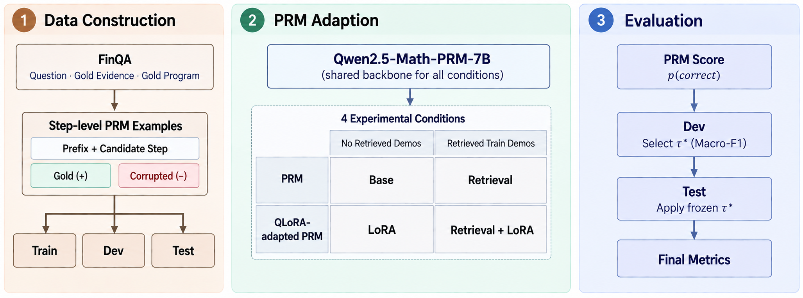
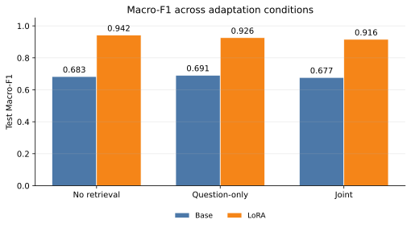
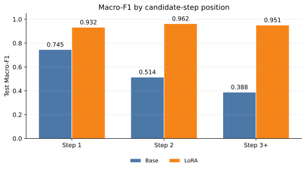
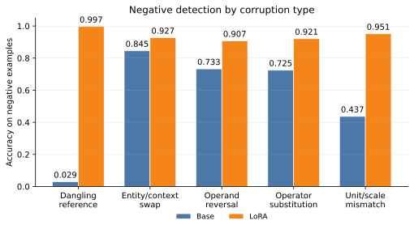

# FinPRM

FinPRM studies step-level process verification for numerical reasoning on FinQA. It uses Qwen2.5-Math-PRM-7B as a shared backbone and compares FinQA QLoRA adaptation with retrieved in-context demonstrations.


## Approach



Each example contains a FinQA question, the supporting evidence, the previous correct steps, and one candidate reasoning step. Then Qwen2.5-Math-PRM-7B predicts whether the candidate step is correct.

We compare two ways to adapt the PRM.
- QLoRA fine-tunes the model on FinQA training examples.
- Retrieval doesn't change the model, it provides similar labeled examples from the Train set at inference time.

## Experimental Setup

### Data

The experiments use the official FinQA Train, Dev, and Test splits. Each gold program is converted into step-level examples.

| Split | FinQA examples | Gold program steps | Primary step examples | Role |
|---|---:|---:|---:|---|
| Train | 6,251 | 9,598 | 19,152 | QLoRA training and retrieval index |
| Dev | 883 | 1,362 | 2,722 | Threshold selection |
| Test | 1,147 | 1,772 | 3,538 | Final evaluation |


### Conditions

The primary experiment is a 2×2 design over parameter adaptation and retrieved demonstrations:

| | No retrieved demonstrations | Train demonstrations retrieved with the joint key |
|---|---|---|
| Base PRM | Base | Retrieval |
| QLoRA-adapted PRM | LoRA | Retrieval + LoRA |

In the main retrieval setting, we retrieve the two most similar Train examples using the question, previous correct steps, and current candidate step.

We also test a simpler retrieval variant that uses only the question to find two similar examples.

### Evaluation

The primary metrics are Accuracy, Macro-F1, and AUROC;

## Key Results

Test results are from `results/main_metrics.csv`.

| Condition | Accuracy | Macro-F1 | AUROC |
|---|---:|---:|---:|
| Base | 0.6843 | 0.6830 | 0.7164 |
| Base + question-only retrieval | 0.6979 | 0.6914 | 0.7163 |
| Base + joint retrieval | 0.6834 | 0.6772 | 0.7161 |
| LoRA | 0.9421 | 0.9421 | 0.9839 |
| LoRA + question-only retrieval | 0.9262 | 0.9262 | 0.9786 |
| LoRA + joint retrieval | 0.9158 | 0.9158 | 0.9718 |



- FinQA QLoRA substantially improves performance over the Base PRM.
- Retrieval has limited effect on the Base PRM.
- Retrieval does not improve LoRA in this setup; both retrieval variants perform below LoRA alone.



Base performance declines at later step positions, while LoRA remains strong across the sequence.



LoRA improves rejection accuracy across all five corruption types. The largest contrast occurs for dangling references.

## Reproducibility

### Repository Structure

```text
finPRM/
├── assets/figures/      # Corresponding figures
├── configs/             # Frozen experiment and retrieval settings
├── results/             # Lightweight result tables
├── scripts/             # Data, training, retrieval, evaluation, and entry points
├── src/
│   └── finprm/
│       ├── data/        # FinQA parsing and step example construction
│       ├── models/      # Qwen PRM processing
│       ├── retrieval/   # Demonstration indexing and formatting
│       └── evaluation/  # Metrics and threshold selection
└── tests/               # Deterministic unit and integration tests

```

### Setup

From the repository root, execute:

```sh
./scripts/setup_gpu.sh
```

Download and verify the FinQA splits, build the process datasets, create the primary balanced sets, and prepare the frozen PRM checkpoint:

```sh

./scripts/prepare_assets.sh

```

### Experiment Commands

Run the CUDA pipeline smoke test before the full experiment:

```sh

./scripts/run_gpu_smoke.sh

```

Run Base evaluation and the QLoRA experiment:

```sh

./scripts/run_lora_experiment.sh

```

Build the retrieval index and frozen prompt plans, then run the retrieval experiment:

```sh

./scripts/run_retrieval_sanity.sh

./scripts/run_retrieval_experiment.sh

```

Run the secondary question-only retrieval ablation:

```sh

./scripts/run_retrieval_experiment.sh question

```

Generate the result tables and regenerate the SVG figures:

```sh

PYTHONPATH=src .venv/bin/python scripts/export_results.py

PYTHONPATH=src .venv/bin/python scripts/plot_results.py

```

## Limitations

This project evaluates step-level verification on FinQA, not general financial reasoning.

All experiments use the gold supporting evidence provided by FinQA, and negative examples are created by modifying correct program steps by ourselves.

Therefore, the results mainly reflect performance on this specific FinQA verification task and do not show how well the model would perform on broader financial reasoning or evidence retrieval.

## References

- Chen et al. (2021), [FinQA: A Dataset of Numerical Reasoning over Financial Data](https://aclanthology.org/2021.emnlp-main.300/).

- Lightman et al. (2023), [Let's Verify Step by Step](https://arxiv.org/abs/2305.20050).

- Qwen Team, [Qwen2.5-Math-PRM-7B](https://huggingface.co/Qwen/Qwen2.5-Math-PRM-7B).

- Dettmers et al. (2023), [QLoRA: Efficient Finetuning of Quantized LLMs](https://arxiv.org/abs/2305.14314).

- BAAI, [BGE small English v1.5](https://huggingface.co/BAAI/bge-small-en-v1.5).